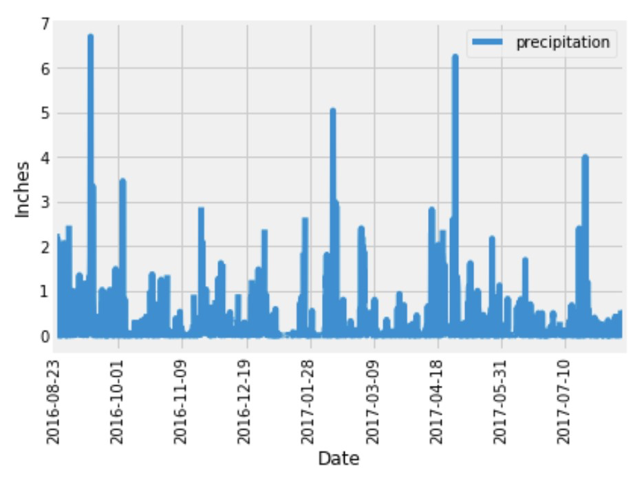
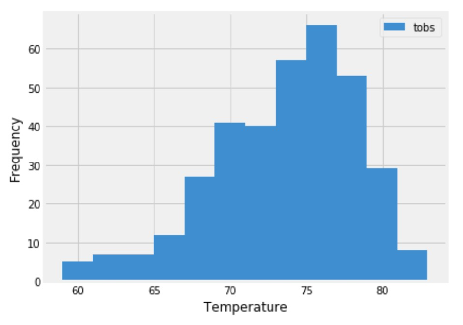

# sqlalchemy-challenge

## Before You Begin
Create a new repository for this project called sqlalchemy-challenge. Do not add this assignment to an existing repository. Clone the new repository to your computer.  
Inside your local Git repository, create a directory for this Challenge. Use a folder name that corresponds to the Challenge, such as SurfsUp.  
Add your Jupyter notebook and app.py to this folder. They’ll contain the main scripts to run for analysis. Also add the Resources folder, which contains the data files you will be using for this challenge.  
Push the changes to GitHub or GitLab. 
## Files
Download the following files to help you get started:  
Module 10 Challenge files Links to an external site. 
## Instructions
Congratulations! You've decided to treat yourself to a long holiday vacation in Honolulu, Hawaii. To help with your trip planning, you decide to do a climate analysis about the area. The following sections outline the steps that you need to take to accomplish this task. 
### Part 1: Analyze and Explore the Climate Data
In this section, you’ll use Python and SQLAlchemy to do a basic climate analysis and data exploration of your climate database. Specifically, you’ll use SQLAlchemy ORM queries, Pandas, and Matplotlib. To do so, complete the following steps:  
Note that you’ll use the provided files (climate_starter.ipynb and hawaii.sqlite) to complete your climate analysis and data exploration.  
Use the SQLAlchemy create_engine() function to connect to your SQLite database. Use the SQLAlchemy automap_base() function to reflect your tables into classes, and then save references to the classes named station and measurement. Link Python to the database by creating a SQLAlchemy session. 
IMPORTANT:Remember to close your session at the end of your notebook. 
Perform a precipitation analysis and then a station analysis by completing the steps in the following two subsections. 
### Precipitation Analysis
Find the most recent date in the dataset.  
Using that date, get the previous 12 months of precipitation data by querying the previous 12 months of data. 
HINT: Don’t pass the date as a variable to your query. 
Select only the "date" and "prcp" values.  
Load the query results into a Pandas DataFrame. Explicitly set the column names.  
Sort the DataFrame values by "date".  
Plot the results by using the DataFrame plot method, as the following image shows:

Use Pandas to print the summary statistics for the precipitation data.  
### Station Analysis 
Design a query to calculate the total number of stations in the dataset.  
Design a query to find the most-active stations (that is, the stations that have the most rows).  
To do so, complete the following steps:  
List the stations and observation counts in descending order.  
HINT:You’ll need to use the func.count function in your query.  
Answer the following question: which station id has the greatest number of observations? Design a query that calculates the lowest, highest, and average temperatures that filters on the most-active station id found in the previous query. 

HINT:You’ll need to use functions such as func.min, func.max, and func.avg in your query.

Design a query to get the previous 12 months of temperature observation (TOBS) data. To do so, complete the following steps:  
Filter by the station that has the greatest number of observations.  
Query the previous 12 months of TOBS data for that station.  
Plot the results as a histogram with bins=12, as the following image shows:  
Close your session.  

## Part 2: Design Your Climate App
Now that you’ve completed your initial analysis, you’ll design a Flask API based on the queries that you just developed. To do so, use Flask to create your routes as follows:  
/  
Start at the homepage.  
List all the available routes. /api/v1.0/precipitation  
Convert the query results from your precipitation analysis (i.e. retrieve only the last 12 months of data) to a dictionary using date as the key and prcp as the value. 
Return the JSON representation of your dictionary.  
/api/v1.0/stations /api/v1.0/tobs  
Return a JSON list of stations from the dataset.  
Query the dates and temperature observations of the most-active station for the previous year of data.  
Return a JSON list of temperature observations for the previous year.  
/api/v1.0/<start> and /api/v1.0/<start>/<end>  
Return a JSON list of the minimum temperature, the average temperature, and the maximum temperature for a specified start or start-end range.  
For a specified start, calculate TMIN, TAVG, and TMAX for all the dates greater than or equal to the start date.  
For a specified start date and end date, calculate TMIN, TAVG, and TMAX for the dates from the start date to the end date, inclusive. 
## Hints
Join the station and measurement tables for some of the queries.  
Use the Flask jsonify function to convert your API data to a valid JSON response object.
## Requirements
#### Jupyter Notebook Database Connection (10 points) 
##### To receive all points, you must 
Use the SQLAlchemy create_engine() function to connect to your SQLite database (1 point)  
Use the SQLAlchemy automap_base() function to reflect your tables into classes (3 points)  
Save references to the classes named station and measurement (4 points)  
Link Python to the database by creating a SQLAlchemy session (1 point)  
Close your session at the end of your notebook (1 point) 
#### Precipitation Analysis (16 points) 
##### To receive all points, you must 
Create a query that finds the most recent date in the dataset (8/23/2017) (2 points) Create a query that collects only the date and precipitation for the last year of data without passing the date as a variable (4 points)  
Save the query results to a Pandas DataFrame to create date and precipitation columns (2 points)  
Sort the DataFrame by date (2 points)  
Plot the results by using the DataFrame plot method with date as the x and precipitation as the y variables (4 points)  
Use Pandas to print the summary statistics for the precipitation data (2 points) 
#### Station Analysis (16 points) 
##### To receive all points, you must 
Design a query that correctly finds the number of stations in the dataset (9) (2 points)  
Design a query that correctly lists the stations and observation counts in descending order and finds the most active station (USC00519281) (2 points)  
Design a query that correctly finds the min, max, and average temperatures for the most active station (USC00519281) (3 points)  
Design a query to get the previous 12 months of temperature observation (TOBS) data that filters by the station that has the greatest number of observations (3 points)  
Save the query results to a Pandas DataFrame (2 points)  
Correctly plot a histogram with bins=12 for the last year of data using tobs as the column to count. (4 points) 
#### API SQLite Connection & Landing Page (10 points) 
##### To receive all points, your Flask application must 
Correctly generate the engine to the correct sqlite file (2 points)  
Use automap_base() and reflect the database schema (2 points)  
Correctly save references to the tables in the sqlite file (measurement and station) (2 points)  
Correctly create and binds the session between the python app and database (2 points)  
Display the available routes on the landing page (2 points) 
#### API Static Routes (15 points) 
##### To receive all points, your Flask application must include 
A precipitation route that:  
Returns json with the date as the key and the value as the precipitation (3 points)  
Only returns the jsonified precipitation data for the last year in the database (3 points)  
A stations route that:  
Returns jsonified data of all of the stations in the database (3 points)  
A tobs route that:  
Returns jsonified data for the most active station (USC00519281) (3 points)  
Only returns the jsonified data for the last year of data (3 points) 
#### API Dynamic Route (15 points) 
##### To receive all points, your Flask application must include 
A start route that:  
Accepts the start date as a parameter from the URL (2 points)  
Returns the min, max, and average temperatures calculated from the given start date to the end of the dataset (4 points)  
A start/end route that:  
Accepts the start and end dates as parameters from the URL (3 points)  
Returns the min, max, and average temperatures calculated from the given start date to the given end date (6 points) 
#### Coding Conventions and Formatting (8 points) 
##### To receive all points, your code must 
Place imports at the top of the file, just after any module comments and docstrings, and before module globals and constants. (2 points)  
Name functions and variables with lowercase characters, with words separated by underscores. (2 points)  
Follow DRY (Don't Repeat Yourself) principles, creating maintainable and reusable code. (2 points)  
Use concise logic and creative engineering where possible. (2 points) 
#### Deployment and Submission (6 points) 
##### To receive all points, you must 
Submit a link to a GitHub repository that’s cloned to your local machine and contains your files. (2 points)  
Use the command line to add your files to the repository. (2 points)  
Include appropriate commit messages in your files. (2 points) 
#### Comments (4 points) 
##### To receive all points, your code must 
Be well commented with concise, relevant notes that other developers can understand. (4 points) 
